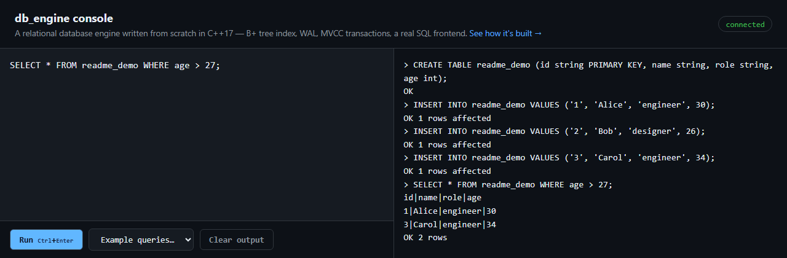

<div align="center">

# db_engine

**A relational database engine, written from scratch in C++17.**

B+ tree index · buffer pool · latch-crabbing concurrency · write-ahead log · MVCC transactions · SQL over TCP

[](https://github.com/sidhesha/db_engine/actions/workflows/build.yml)
[](LICENSE)
[](https://en.cppreference.com/w/cpp/17)
[](.github/workflows/build.yml)

[**Try it live →**](https://sidhesha.github.io/db_engine-console/)

</div>

---

No external database library, no ORM — every layer below is built from first principles and
mirrors how a real database (PostgreSQL, InnoDB) implements the same concept. Seven phases, each
independently demo-able: see [`docs/ROADMAP.md`](docs/ROADMAP.md) for the full build log and
[`docs/BENCHMARKS.md`](docs/BENCHMARKS.md) for real, captured numbers.

<p align="center">
  <a href="https://sidhesha.github.io/db_engine-console/">
    
  </a>
  <br>
  <sub>The web console above talks to this exact engine over a real TCP connection — <a href="https://sidhesha.github.io/db_engine-console/">try it yourself</a>.</sub>
</p>

## Contents

- [Highlights](#highlights)
- [Architecture](#architecture)
- [Quick start](#quick-start)
- [Testing & benchmarking](#testing--benchmarking)
- [Project structure](#project-structure)
- [Documentation](#documentation)
- [Contributing](#contributing)
- [License](#license)

## Highlights

- **B+ tree index** with latch crabbing (hand-over-hand) and a B-link design, so reads, writes,
  splits, and merges all run concurrently without a single global lock — validated under many
  concurrent threads, not just single-threaded correctness.
- **ARIES-style write-ahead log**: redo replays committed changes that never reached disk; undo
  reverts uncommitted ones, itself logged as compensation records so a crash *during* recovery is
  still recoverable.
- **MVCC transactions**: snapshot isolation, readers never block writers. Rollback needs no
  separate undo log — an update's backward chain of prior versions *is* the undo log. Row-level
  locking backed by a real waits-for-graph deadlock detector, not a timeout guess.
- **A SQL frontend you can actually connect to**: a hand-rolled lexer and recursive-descent parser
  feed a query executor bound to the storage engine, served over a real multi-threaded TCP socket —
  concurrent connections genuinely serialize on row locks and see correct snapshot isolation,
  because the engine underneath actually is concurrency-safe.
- **A pluggable eviction policy**, proven, not just implemented: a benchmark demonstrates LRU-2
  keeping a hot working set 100% resident through a sequential scan that drops plain clock-sweep to
  0% — the literal scenario LRU-2 exists to solve.
- **Model-based fuzz testing**: a shadow model cross-checked against thousands of random operations,
  catching silent wrong-answer bugs, not just crashes.
- **Runs on Windows and Linux**: the SQL server's networking layer builds against Winsock2 or POSIX
  sockets behind one small compat shim — CI builds and runs the full test suite on both.

## Architecture

```
                     any raw TCP client ('ncat', a script, ...)
                                   │  ';'-terminated SQL text
                                   ▼
                     ┌─────────────────────────┐
                     │        SqlServer         │  Winsock2/POSIX, one thread/connection
                     └────────────┬─────────────┘
                                   ▼
                     ┌─────────────────────────┐
                     │  Lexer → Parser → AST    │  hand-rolled, recursive-descent
                     └────────────┬─────────────┘
                                   ▼
                     ┌─────────────────────────┐
                     │        Executor          │  binds the AST to Table calls
                     └────────────┬─────────────┘
                                   ▼
   ┌───────────────────────────────────────────────────────────────┐
   │                          Database                              │
   │        one shared WAL + TransactionManager + MVCCManager        │
   │                                                                 │
   │   ┌─────────────────────── Table (per table) ─────────────────┐ │
   │   │  MVCCManager      snapshot isolation, version visibility   │ │
   │   │  LockManager      row-level locks, waits-for-graph          │ │
   │   │  BPlusTree        latch-crabbing, B-link, on-disk index     │ │
   │   │  RecordManager    slotted-page row storage                  │ │
   │   └───────────────────────────────────────────────────────────┘ │
   └────────────────────────────┬────────────────────────────────────┘
                                   ▼
                     ┌─────────────────────────┐
                     │  PageManager/BufferPool  │  clock-sweep or LRU-2 (pluggable)
                     └────────────┬─────────────┘
                                   ▼
                     ┌─────────────────────────┐
                     │   WAL (ARIES redo/undo)  │
                     │   + heap/index files      │
                     └─────────────────────────┘
```

## Quick start

```powershell
cmake -S . -B build
cmake --build build
build\db_engine.exe
```

This starts the SQL server on port `5433`, creating `db_data/` on first run. From another
terminal (or any raw TCP client):

```
$ ncat 127.0.0.1 5433
CREATE TABLE users (id string PRIMARY KEY, name string, age int);
OK
INSERT INTO users VALUES ('1', 'Alice', 30);
OK 1 rows affected
INSERT INTO users VALUES ('2', 'Bob', 25);
OK 1 rows affected
SELECT * FROM users WHERE age > 26;
id|name|age
1|Alice|30
OK 1 rows
BEGIN;
OK
UPDATE users SET age = 31 WHERE id = '1';
OK 1 rows affected
ROLLBACK;
OK
```

Type `quit` in the server's own terminal to shut it down.

## Testing & benchmarking

```powershell
build\db_engine_test.exe     # 180 tests, single process, no external dependencies
build\db_engine_bench.exe    # throughput/latency/eviction numbers -- see docs/BENCHMARKS.md
```

`db_engine_bench` is always built at `-O2` regardless of `CMAKE_BUILD_TYPE`, separate from the
`-O0` debug build the test suite uses — see [`AGENTS.md`](AGENTS.md) for the full build/test/PR
workflow.

## Project structure

```
db_engine/
├── include/db_engine/   Public headers
├── src/                 Implementation + entry point (main.cpp)
├── tests/                Full correctness suite (single file, no framework dependency)
├── bench/                Benchmark harness
├── docs/
│   ├── ROADMAP.md         Phase-by-phase build log and design decisions
│   ├── BENCHMARKS.md      Real numbers, captured and explained
│   └── CONCURRENCY_BUGS.md  Five real concurrency bugs found and fixed, with root causes
├── CMakeLists.txt
└── AGENTS.md             Build/test/PR workflow
```

## Documentation

| | |
|---|---|
| [`docs/ROADMAP.md`](docs/ROADMAP.md) | Every phase's design decisions, what was built, and why — written as the project progressed, not after the fact. |
| [`docs/BENCHMARKS.md`](docs/BENCHMARKS.md) | Real, machine-labeled numbers: throughput, latency, cache-vs-no-cache, single-vs-concurrent, the eviction shootout. |
| [`docs/CONCURRENCY_BUGS.md`](docs/CONCURRENCY_BUGS.md) | Five related concurrency bugs found during development — root causes, fixes, and the debugging methodology used to find them. |

**Related:** [`db_engine-console`](https://github.com/sidhesha/db_engine-console) — the web SQL
console shown above (browser frontend + a thin WebSocket↔TCP bridge to this engine).

## Contributing

See [`AGENTS.md`](AGENTS.md) for the build/test/PR workflow — TL;DR: branch, write a failing test,
implement, run the full suite, open a PR. CI must be green before merging.

## License

[MIT](LICENSE)
